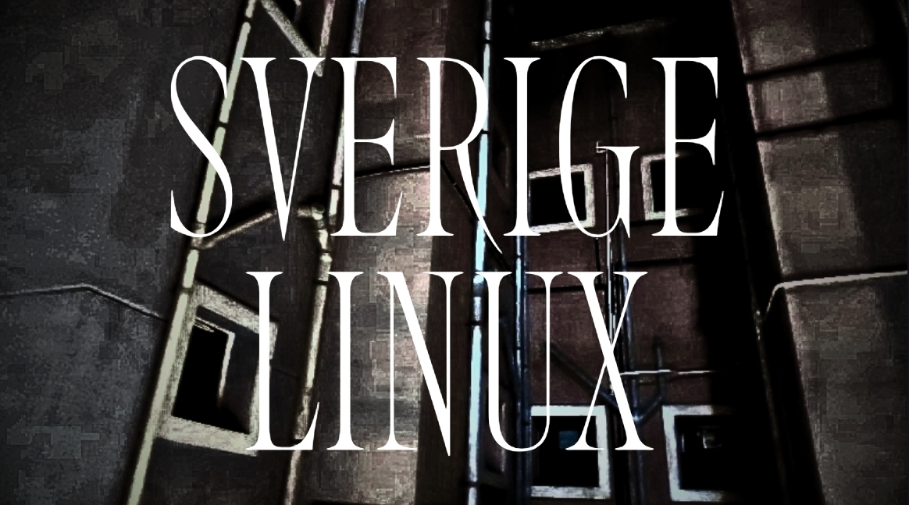

# sverige Linux

sverige Linux is an independent x86_64 Linux system built from upstream source.

The project focuses on building the system directly from the software it uses rather than distributing a pre-built base system.

---

## What is sverige?

The base system is built from upstream projects including GNU, the Linux kernel, systemd, Musl, BusyBox and other components.

### Source-based

Software is obtained from its upstream source archives and built during the installation process via the saada package manager.

### x86_64

The current build is designed for x86_64 systems.

### init

The base system uses systemd and an upcoming Musl/BusyBox documentation.

[Read the Base Guide →](guide.md)

---

## Suomi

**Suomi** is the planned extended userspace guide for software that is not part of the base installation.

It will cover areas such as:

- Wayland and X11
- Mesa and NVIDIA
- PipeWire
- Desktop environments
- Multimedia software

**Status: In development**

---

## Source

The project is available on GitHub
[View the sverige Linux repository →](https://github.com/ollipix/sverige)
